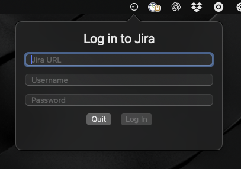
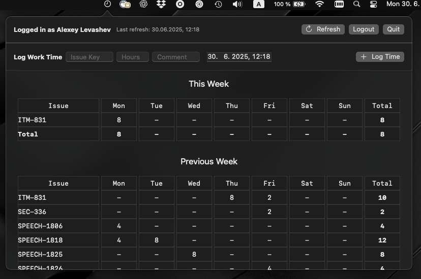

🧭 Jira Weeklog macOS App

<table>
<tr>
<td></td>
<td></td>
</tr>
</table>

A lightweight native macOS menu bar app for viewing your weekly Jira worklogs at a glance.
It connects to your Jira account via REST API and displays a summary of logged hours per issue, helping you track time without opening the Jira UI.

✨ Features
• Displays total worklog hours for the current week
• Groups logged time by issue and date
• Supports both manual and automatic refresh
• Uses basic authentication (username + password)
• Runs in the macOS menu bar — no Dock icon
• Built with SwiftUI for a smooth native experience

📦 Technologies
• Swift, SwiftUI, Combine
• Jira REST API
• AppKit (for NSStatusItem menu bar integration)

🔄 Auto-Refresh

The app periodically updates the displayed worklogs in the background, so your weekly data stays up to date without manual interaction.
